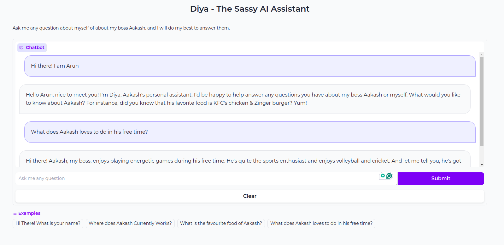
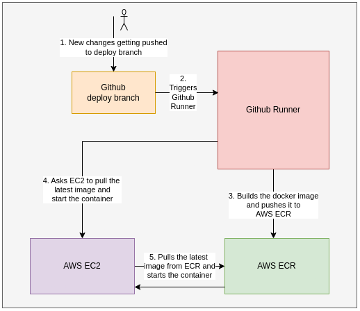

# Diya: The Digital AI Assistant

### WHO IS DIYA?

- Diya is a AI powered personal assistant who can answer any queries about Me.

- You can have a chat with Diya @ http://3.80.130.244/. Below is a sample screenshot of a short conversation with Diya and its Web UI Interface.

 

# TECHNICAL DETAILS

- Diya is a LLM based chatbot powered by Mistral 7B Instruct v0.2. | [paper-link](https://arxiv.org/pdf/2310.06825.pdf) | [hugginface-repo](https://huggingface.co/mistralai/Mistral-7B-Instruct-v0.2).

- It uses a simple RAG based approach to undertsand the basic information about me and responds to the user's query accordingly in a sarcastic way.

- The LLM chat agent is converted into a simple UI using [Gradio](https://www.gradio.app/).

- Similar AI assistant can be easily created for anyone just by modifying the information data and reusing the remaining code.

- This app is built using best MLOPs practices and deployed as a end-to-end pipeline on AWS EC2(t2.micro) as a docker image using github actions.

- Refer to PRODUCTION DEPLOYMENT section to understand how the pipeline is built.
 

# STEPS TO RUN LOCALLY

- This chatbot can be used locally in two modes.

## 1. USING A LLM INSTANCE LOCALLY FOR QUESTION ANSWERING.

- All source code related to this module are available in `src/local_llm/`.

- It downloads a Mistral 7B Instruct from huggingface and uses it for inference.

- Builds a pipeline using langchain which converts the user query into a prompt along with past chat history, inferes the prompt using the instantiated Mistral LLM and streams the generated response in real time. Finally it logs the prompt and response onto comet ml dashboard for tracking.

- The application is deployed as a simple webapp using GRADIO. 

### STEPS TO RUN THE APP WITH A LOCALLY DOWNLOADED LLM

[NOTE: You will need a GPU with 16GB VRAM to run this application via a local llm. If you don't have the resources skip to section 2 where can you run the chatbot on any machine using mistral api.]

1. Login to [COMET-ML](https://www.comet.com/). Create a project and a api key using which we log the prompts and response.

2. Set the environment variables `COMET_WORKSPACE`, `COMET_PROJECT_NAME`, `COMET_API_KEY`. (COMET_WORKSPACE is your comet username). Comet uses this environment variables to log the prompts and responses.

3. Install the necassary requirements using `pip install -r  src/local_llm/requirements.txt`. (Better create a new virtual env to avoid conflicts).

4. Run the application by running `./run_local_llm_app.sh`.

## 2. USING MISTRAL API FOR QUESTION ANSWERING.

- All source code related to this module are available in `src/llm_api/`.

- It uses the endpoint provided by mistral api services for question answering.

- Simply converts the user query into prompt along with past chat history, inferes the prompt using the API and streams the response in real time to the front end UI which is similarly build using gradio.

### STEPS TO RUN THE APP WITH MISTRAL API

1. Login to [COMET-ML](https://www.comet.com/). Create a project and a api key using which we log the prompts and response.

2. Additionaly login to mistral.ai console [(console-link)](https://console.mistral.ai/), and create a API key. You will be charged as per the API usage and the pricing is relatively low with the open-sourced instruct 7b version. ($0.25 / 1Million tokens). For more details on pricing check out this [link](https://docs.mistral.ai/platform/pricing/).

2. Set the environment variables `MISTRAL_API_KEY`, `COMET_WORKSPACE`, `COMET_PROJECT_NAME`, `COMET_API_KEY`. (COMET_WORKSPACE is your comet username). Comet uses this environment variables to log the prompts and responses.

3. Install the necassary requirements using `pip install -r  src/llm_api/requirements.txt`. (Better create a new virtual env to avoid conflicts).

4. Run the application by running `./run_llm_api_app.sh`.
 

# PRODUCTION DEPLOYMENT.

- For production deployment mistral api is used for question answering since we need a device with 16GB GPU RAM on the other mode.

- The entire workflow is defined on `.github/workflows/cd_llm_api_app.yaml`. It gets triggered once a push is made onto `deploy` branch.

- The neccasay environment variables tosuch as mistral api key, comet ml logger, and aws credentials are set on github action secrets and will be used by the github runner for deployment.

- Once a push is made onto deploy branch, the runner checks the code, builds the docker image, logs on to AWS using the keys provided in secrets, pushes the build docker image onto AWS ECR(Elastic Container Registry).

- Once the image is pushed to ECR, second job gets triggered which runs inside a EC2 instance. It pulls the latest docker image from ECR and starts the container.

 
The below image shows how the production pipeline is build with github actions.  
 

